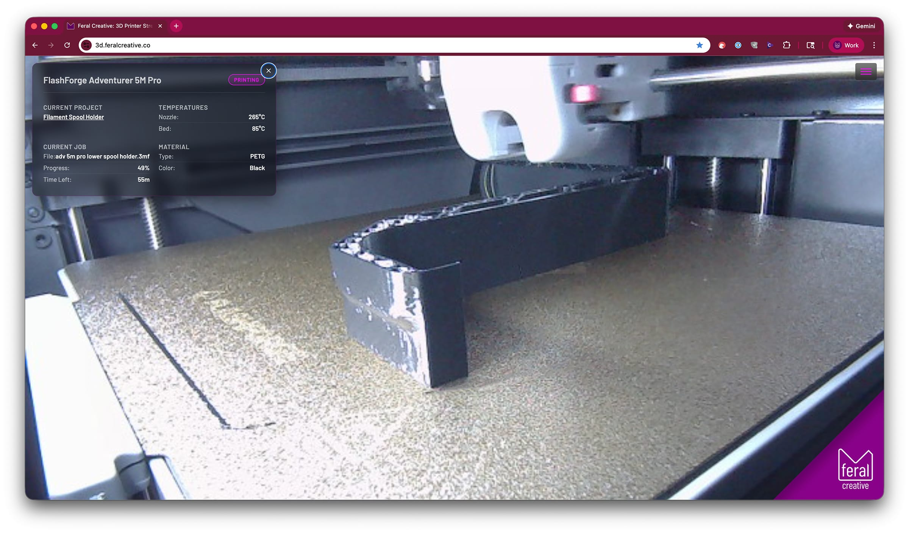
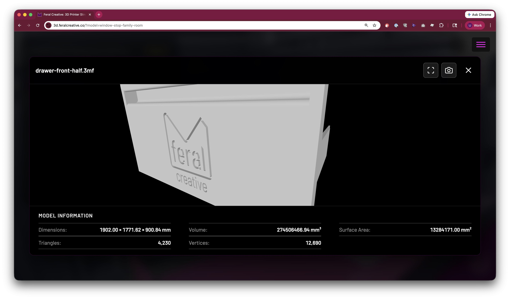

# 3D Printer Stream

Live stream of Feral Creative's FlashForge Adventurer 5M Pro 3D printer with real-time status overlay and Google OAuth authentication.



## Features

- **Live MJPEG Stream** - Real-time video from Synology Surveillance Station
- **Google OAuth Authentication** - Secure access with tiered email whitelisting
- **Real-time Printer Status** - Temperature, progress, and print information overlay
- **3D Model Viewer** - View current print model in 3D by clicking the filename or via `?model=` URL deeplink
- **File Upload with STL Repair** - Upload files directly to printer with automatic STL repair using PyMeshLab
- **Slack Notifications** - Print event alerts (started, completed, failed, paused)
- **Responsive Design** - Works on desktop and mobile devices
- **PWA Support** - Installable on iOS and Android with proper meta tags
- **Dev Mode** - Bypass authentication on localhost for development
- **Docker Deployment** - Containerized deployment (Nginx + Node.js + PHP) to Synology NAS

## 3D Model Viewer

The application includes an interactive 3D model viewer that allows you to view the current print model in 3D.



### How to Use

1. **Place Model Files**: Add your STL files to the `public/models/` directory
2. **Match Filenames**: The STL filename (without extension) must match the job filename reported by the printer
   - Example: If printer shows `test-cube.3mf`, place file as `public/models/test-cube.stl`
3. **Click to View**: When a print is active, click the filename in the printer status overlay to open the 3D viewer
4. **Deep Link**: Share or bookmark `https://3d.feralcreative.co/?model=filename` to open a specific model directly

### File Format

The viewer displays **STL files only**. The application automatically converts the printer's filename (e.g., `.3mf` from Orca Slicer) to `.stl` format:

- Printer reports: `my-model.3mf`
- Viewer looks for: `public/models/my-model.stl`

**Note**: You must export/save your original STL file with the same base filename as your sliced file.

### Viewer Controls

- **Rotate**: Click and drag with left mouse button
- **Zoom**: Scroll wheel or pinch gesture
- **Pan**: Right-click and drag (or two-finger drag on trackpad)
- **Close**: Click the X button, press ESC, or click outside the modal

### Example Workflow

```bash
# 1. You have an STL file
my-awesome-print.stl

# 2. Slice it in Orca Slicer, which creates
my-awesome-print.3mf

# 3. Send to printer (printer shows "my-awesome-print.3mf")

# 4. Place your original STL in the models directory
cp my-awesome-print.stl public/models/

# 5. Click the filename in the web interface to view the 3D model
```

**Note**: The viewer automatically strips the extension and looks for a `.stl` file. If the file is not found, an error message will be displayed.

## STL File Upload & Repair

The application includes a built-in file upload system with automatic STL repair functionality powered by PyMeshLab.

### Features

- **Drag & Drop Upload** - Upload STL, 3MF, GX, and GCODE files directly to the printer
- **Automatic STL Repair** - Fixes common issues in STL files before printing:
  - Non-manifold edges
  - Duplicate faces
  - Inverted normals
  - Isolated vertices and degenerate faces
- **Optional Repair** - Toggle automatic repair on/off per upload
- **Print Options** - Start printing immediately and/or level bed before printing
- **File Validation** - Checks file type and size (max 500MB)
- **Progress Feedback** - Real-time status updates during upload and repair

### Installation Requirements

PyMeshLab (Python library) must be installed on the server running the printer proxy:

```bash
# Install Python dependencies
pip3 install -r requirements.txt

# Or install PyMeshLab directly
pip3 install pymeshlab
```

**Verify installation:**

```bash
python3 -c "import pymeshlab; print(pymeshlab.__version__)"
# Should output: 2025.7.post1 (or similar)
```

### How to Use

1. **Sign in** to the application with your authorized Google account
2. **Click the hamburger menu** (three lines) in the top-left corner
3. **Click "Upload File"** to open the upload modal (requires upload permission)
4. **Select or drag & drop** your file (STL, 3MF, GX, or GCODE)
5. **Configure options:**
   - ✅ **Automatically repair STL files** (recommended, enabled by default)
   - ⬜ **Send to printer** (disabled by default - if unchecked, will only repair and download)
     - ⬜ **Start printing immediately** (only if sending to printer)
     - ⬜ **Level bed before printing** (only if sending to printer)
6. **Click "Upload"** to process the file

**Default behavior**: The file will be repaired (if STL) and downloaded to your computer. The printer will NOT be touched unless you explicitly check "Send to printer".

### What Gets Fixed

PyMeshLab automatically repairs the following issues in STL files:

- **Duplicate Faces and Vertices**: Removes redundant geometry
- **Unreferenced Vertices**: Cleans up unused vertices
- **Non-Manifold Edges**: Fixes edges shared by more than two faces
- **Non-Manifold Vertices**: Splits vertices to create manifold geometry
- **Holes**: Closes holes in the mesh (up to 30 edges)
- **Face Orientation**: Re-orients all faces coherently
- **Mismatched Borders**: Snaps nearby vertices to close tiny gaps

### Troubleshooting

#### "PyMeshLab not installed" Error

**Cause**: PyMeshLab is not installed or not in the Python PATH

**Solution**:

```bash
# Install PyMeshLab
pip3 install pymeshlab

# Verify installation
python3 -c "import pymeshlab; print(pymeshlab.__version__)"
```

#### Upload Fails with "Invalid file type"

**Cause**: File extension is not supported

**Solution**: Only these file types are supported:

The application uses a three-tier permission system:

| Tier     | Config Key              | Access                                           |
| -------- | ----------------------- | ------------------------------------------------ |
| Viewer   | `ALLOWED_EMAILS`        | View stream, see printer status                  |
| Uploader | `UPLOAD_ALLOWED_EMAILS` | All above + file upload                          |
| Advanced | `ADVANCED_FEATURES`     | All above + STL repair, prep for filament change |

Domain wildcards are supported (e.g., `@feralcreative.co` grants access to all addresses on that domain).

## Slack Notifications

The application sends Slack notifications for key print events:

- Print started
- Print completed
- Print failed
- Print paused

Notifications are sent via a webhook configured in `config.js`. The system includes a 1-minute cooldown to avoid duplicate notifications.

## Quick Start

### Development

```bash
# Install dependencies
npm install

# Start both proxy server and dev server
npm start
```

This starts the **Vite dev server** on <http://localhost:5501> and the **proxy server** on <http://localhost:3001>.

Visit: <http://localhost:5501>

**Note:** In production, the printer API is accessed through a reverse proxy at `https://3dprinter.feralcreative.co` which routes to the Docker container running `printer-proxy-server.js` on port 6199.

### Production Build

```bash
# Build for production
npm run build

# Preview production build
npm run preview
```

## Docker Deployment

### Prerequisites

- Docker installed locally (for building images)
- SSH access to your Synology NAS
- SSH key authentication configured
- Cloudflare API credentials (optional, for cache purging)

### Configuration

Update the deployment scripts (`utils/deploy/prod.sh` and `utils/deploy/deploy-utils.sh`) with your NAS details:

- **NAS Host**: Your NAS hostname or IP
- **SSH Port**: Your SSH port (default: 22)
- **NAS User**: Your NAS username
- **Deploy Path**: Path on NAS (e.g., `/volume1/web/your-project`)
- **Container Name**: Docker container name
- **Host Port**: Port to expose on host (e.g., 6198)

### Environment Variables

1. **Copy the example environment file:**

   ```bash
   cp .env.example .env
   ```

2. **Edit `.env` and configure:**

   ```bash
   # Application Configuration
   PORT=3000
   NODE_ENV=production
   SESSION_SECRET=your_random_secret_here

   # Cloudflare Configuration (Optional)
   CLOUDFLARE_API_TOKEN=your_cloudflare_api_token
   CLOUDFLARE_ZONE_ID=your_cloudflare_zone_id
   ```

3. **Get Cloudflare credentials (optional):**
   - API Token: <https://dash.cloudflare.com/profile/api-tokens>
     - Create token with "Zone.Cache Purge" permissions
   - Zone ID: <https://dash.cloudflare.com/> > Select domain > Overview (right sidebar)

### Deployment Steps

1. **Deploy to production:**

   ```bash
   ./utils/deploy/prod.sh
   ```

   This script will:
   - Build Docker image locally (linux/amd64 platform)
   - Save and compress the image
   - Transfer image to NAS via SSH
   - Load image on NAS
   - Create required directories
   - Deploy using docker-compose
   - Verify deployment
   - Purge Cloudflare cache (if configured)
   - Show container status and logs

2. **Monitor deployment:**
   The script provides real-time feedback with colored output:
   - 🔵 INFO - General information
   - 🟢 SUCCESS - Successful operations
   - 🟡 WARNING - Non-critical warnings
   - 🔴 ERROR - Critical errors

### Deployment Utilities

Manage the deployed container using the utilities script:

```bash
# View live logs (Ctrl+C to exit)
./utils/deploy/deploy-utils.sh logs

# Check container status
./utils/deploy/deploy-utils.sh status

# Restart container
./utils/deploy/deploy-utils.sh restart

# Stop container
./utils/deploy/deploy-utils.sh stop

# Start container
./utils/deploy/deploy-utils.sh start

# Open shell in container
./utils/deploy/deploy-utils.sh shell

# Backup data directory
./utils/deploy/deploy-utils.sh backup

# Restore from backup
./utils/deploy/deploy-utils.sh restore backup-file.tar.gz

# Sync local data to NAS
./utils/deploy/deploy-utils.sh update-data

# Show help
./utils/deploy/deploy-utils.sh help
```

### Cloudflare Cache Purging

The deployment script automatically purges Cloudflare cache after deployment if credentials are configured in `.env`.

**Setup:**

1. Add `CLOUDFLARE_API_TOKEN` and `CLOUDFLARE_ZONE_ID` to `.env`
2. Cache will be purged automatically after each deployment
3. If credentials are missing, cache purging is skipped (non-fatal)

**Manual cache purge:**

```bash
# Test cache purge
curl -X POST "https://api.cloudflare.com/client/v4/zones/${CLOUDFLARE_ZONE_ID}/purge_cache" \
  -H "Authorization: Bearer ${CLOUDFLARE_API_TOKEN}" \
  -H "Content-Type: application/json" \
  -d '{"purge_everything":true}'
```

### Accessing the Application

After deployment, the application is accessible at:

- **Direct**: <http://your-nas-hostname:6198>
- **Production**: <https://yourdomain.com> (via reverse proxy)

### Troubleshooting

**SSH Connection Issues:**

```bash
# Test SSH connection
ssh -p YOUR_SSH_PORT user@your-nas-hostname "echo 'Connection successful'"

# If prompted for password, add your SSH key
ssh-copy-id -p YOUR_SSH_PORT user@your-nas-hostname
```

**Docker Build Issues:**

```bash
# Ensure Docker is running
docker ps

# Test build locally
docker build --platform linux/amd64 -t 3d-printer-stream:latest .

# Check image size
docker images 3d-printer-stream:latest
```

**Container Not Starting:**

```bash
# Check container logs
./utils/deploy/deploy-utils.sh logs

# Check container status
./utils/deploy/deploy-utils.sh status

# Restart container
./utils/deploy/deploy-utils.sh restart
```

**Port Already in Use:**

- Port 6198 (Nginx/web) and 6199 (printer proxy) are configured for this project
- If ports are in use, update `docker-compose.yml` and `utils/deploy/prod.sh`
- Choose unique ports not used by other projects

## Project Structure

```text
3d-printer-stream/
├── index.html                  # Main application page
├── auth.js                     # Google OAuth authentication
├── printer.js                  # Printer API client
├── config.js                   # Application configuration
├── logger.js                   # Client-side logging utility
├── notifications.js            # Slack notification integration
├── viewer-3d.js                # 3D model viewer module
├── printer-proxy-server.js     # Printer API proxy server (runs in Docker)
├── server.js                   # Development proxy server (port 3001)
├── styles/
│   ├── scss/                   # SCSS source files
│   └── css/                    # Compiled CSS
├── images/                     # Images and icons
├── public/
│   └── models/                 # STL model files for 3D viewer
├── utils/
│   ├── stl-repair.js           # PyMeshLab STL repair wrapper (Node.js)
│   ├── pymeshlab-repair.py     # Python STL repair script
│   ├── tcp-gcode-session.js    # Direct TCP G-code communication
│   ├── patch-server.js         # Patch/gcode server utility
│   ├── log.php                 # Server-side logging endpoint
│   ├── view-logs.php           # Log viewer interface
│   ├── printer-proxy.php       # PHP printer API proxy
│   └── deploy/
│       ├── prod.sh             # Production deployment script
│       └── deploy-utils.sh     # Deployment utilities
├── Dockerfile                  # Docker image definition (Nginx + Node.js + PHP + PyMeshLab)
├── docker-compose.yml          # Docker Compose configuration
├── .dockerignore               # Docker build exclusions
├── .env                        # Environment variables (not in git)
├── .env.example                # Environment template
└── vite.config.js              # Vite configuration
```

## Technology Stack

- **Frontend**: Vanilla JavaScript (ES6+), HTML5, CSS3
- **Build Tool**: Vite
- **Authentication**: Google Sign-In API (OAuth 2.0)
- **Video Stream**: MJPEG from Synology Surveillance Station
- **Printer API**: FlashForge Adventurer 5M Pro HTTP API
- **3D Model Viewer**: [Online 3D Viewer](https://github.com/kovacsv/online3dviewer) by Viktor Kovacs
- **STL Repair**: PyMeshLab (Python) via `utils/pymeshlab-repair.py`
- **Dev Proxy**: Node.js + Express (`server.js` on port 3001)
- **Production Proxy**: Node.js + Express (`printer-proxy-server.js` on port 6199)
- **Web Server**: Nginx (serves static frontend on port 6198 in Docker)
- **Notifications**: Slack webhooks
- **Deployment**: Docker + Docker Compose on Synology NAS
- **Reverse Proxy**: Synology (3dprinter.feralcreative.co → localhost:6199)
- **CDN**: Cloudflare (with automatic cache purging)

## Printer Proxy Architecture

The application uses a Node.js proxy server to communicate with the FlashForge printer:

### Production Setup

```text
Browser (yourdomain.com)
    ↓ HTTPS
Synology Reverse Proxy (3dprinter.feralcreative.co)
    ↓ HTTP
Docker Container (printer-proxy-server.js:6199)
    ↓ HTTP
FlashForge Printer (192.168.1.55:8898)
```

### Docker Container Services

The Docker container runs three services:

1. **Nginx** (port 6198) — serves the built frontend static files
2. **Node.js printer proxy** (`printer-proxy-server.js`, port 6199) — proxies requests to printer
3. **PHP-FPM** — handles `log.php` and `view-logs.php`

All managed by pm2.

### Configuration

1. **Reverse Proxy Rule** (Synology DSM):
   - Source: `https://3dprinter.feralcreative.co:443`
   - Destination: `http://localhost:6199`

2. **Endpoints**:
   - `/product` - Printer information
   - `/detail` - Machine status (temperatures, progress)
   - `/upload` - File upload and optional STL repair

### Why a Proxy?

The FlashForge printer's HTTP API doesn't support CORS, preventing direct browser access. The proxy server:

- Adds CORS headers for browser compatibility
- Runs on the same network as the printer
- Provides verbose logging for troubleshooting
- Handles file upload and STL repair
- Routes Slack notification webhooks to avoid CORS restrictions

## Acknowledgments

This project uses the [FlashForge TypeScript API](https://github.com/GhostTypes/ff-5mp-api-ts) by GhostTypes as a reference for understanding the FlashForge Adventurer 5M Pro HTTP API.

## License

ISC

## Author

Ziad Ezzat, [Feral Creative](https://github.com/feralcreative)
